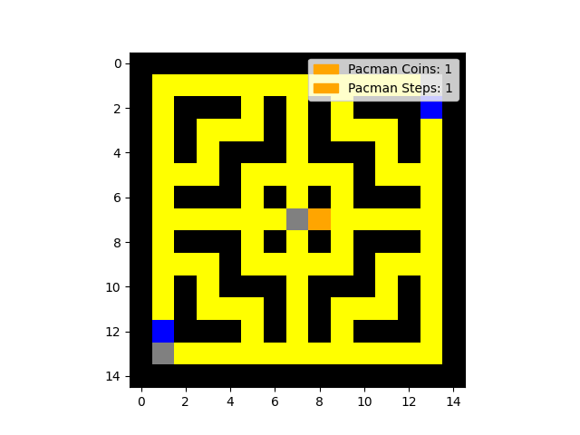
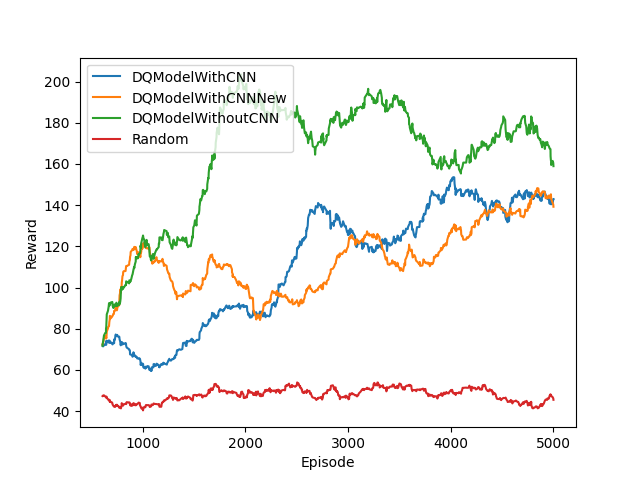

# Pac-Man - AI

> Please note that the code and contributions in this GitHub repository were created through a collaborative effort by [@Irish-77](https://github.com/Irish-77) and [@Ronho](https://github.com/Ronho). Both contributors acknowledge that their work is of equal merit and that they each have a deep understanding of the other's contributions.

This project aims to implement a Markov decision process inspired by the well-known Pac-Man game. The maps are represented by simple csv files and can thus be easily created. Four different algorithms were tested against each other, three of which are based on reinforcement learning, specifically Deep Q-networks.

## Table of contents
1. [Installation](#installation)
1. [Description](#description)
    1. [Environment](#environment)
    1. [Workflow](#workflow)
    1. [Trainings and Results](#trainings-and-results)

## Installation

First, the project must be cloned via git using the following command.
```sh
git clone https://github.com/C2G-BR/Pac-Man-AI.git
```
Additionally, a Python environment is required. All necessary packages can be installed with the command
```sh
pip install -r requirements.txt
```
that must be executed inside the project's folder.

<!-- python src/main.py -m play -id RandomTest_300 -map small_map_quadratic.csv -s -ms 500 -pc 1 -->
Basically there are two applications, whose rough functionality is described below. The 'main.py' contains the training and testing of the models. With
```sh
python src/main.py -h
```
the configuration settings can be viewed. An example call is depicted below.
```sh
python src/main.py -id Random -m train -map small_map_quadratic.csv -ne 5000 -tu 50 -st 10 -ie 1 -ed 1 -lr 0 -rfc 5 -rfs 0.1 -rfi -0.1 -rfh -10 -rfw 20 -rfms -10 -ms 500 -pc 1
```
With the parameter '-m' or '--mode' you can switch between training and testing. An example test run can be called with the command below.
```sh
python src/main.py -m play -id Random_100 -map small_map_quadratic.csv -s -ms 500 -pc 1
```
The number 100 after the original id indicates the checkpoint that should be used. A more detailed description of all parameters can be found in the help function.

The 'visualize.py' can be called via
```sh
python src/visualize.py
```
There are no customizable parameters available. Visualizations of the reward per episode are made for all '.csv' files which are stored in the [data](data/) folder. The process of visualizing the reward requires the csv data to be in its raw state like when it was downloaded from tensorboard. The image will be generated inside the [img](img/) folder. A sliding window with size N=100 is applied to reduce the noise.

## Description

### Environment
The Pac-Man environment is built up on customized maps which can be found inside the 'map' folder. Each number maps to a specific part of the environment as follows:

- '0': empty field - can be walked on
- '1': wall - cannot be crossed
- '2': spawnpoint of Pac-Man (only one per map allowed)
- '3': spawnpoints of ghosts (multiple spawnpoints will generate mulitple ghosts).

The map must be enclosed by walls. The following picture shows an example map called 'small_map_quadratic.csv'. Walls are displayed in black, coins in yellow, empty fields in grey, ghosts in blue and Pac-Man in orange.



Ghosts go in one direction until they either run into a dead end or hit a crossing. When they reach such a point, the permissible directions are determined and it is randomly decided which way to go next. The direction from which the ghost comes is not permissible at a crossing.

Pac-Man is controlled by an agent. An agent in turn contains a model that makes the predictions for the agent. The agent follows the epsilon-greedy-scheme for training. In the 'model.py' some models are already implemented, which build on the base class contained therein. Basically, Pac-Man can move according to the four cardinal directions and always takes exactly one step. Pac-Man can't walk crosswise and can't stop.

An episode can be ended in several ways. Firstly, Pac-Man can touch a ghost, and secondly, the maximum number of steps can be reached. In addition, an episode also ends when Pac-Man has collected all the coins on the map.

In each step, the environment determines rewards based on the state of the environment. The amount of rewards can be set when training a model. Rewards are issued in the following cases:

- 'reward_for_coin' (+): is output when Pac-Man has collected a coin in the step
- 'reward_for_step' (-): is output in each time step
- 'reward_for_inactive' (-): is output if Pac-Man has not changed his position (e.g. has run into a wall)
- 'reward_for_hit' (-): is output when Pac-Man is on the same field with a ghost
- 'reward_for_max_steps' (-): is output if no other termination criterion has occurred within the time steps

The signs by the descriptions indicate whether the reward should be chosen as a rule positive or negative.

### Workflow

The following describes a typical workflow for working with this project, allowing new models to be implemented and tried out quickly.

1. Create a new model.
1. Load model into 'main.py' and replace 'MODEL' constant in the file.
1. Train the model by calling `python src/model.py -m train` with the selected parameters.
1. View the written data in tensorboard with `tensorboard --logdir tensorboard` in the root folder of this project.
1. Download the reward for each relevant run and place it in the 'data' folder.
1. Call `python src/visualize.py`.
1. View image in 'img' folder.

Alternatively, run a test pass after the third step with `python src/main.py -m play` with the respective settings.

### Trainings and Results

In the course of this project, three different models were implemented and over 5000 episodes trained. An example call looks like this:
```sh
python src/main.py -id DQModelWithCNN -m train -map small_map_quadratic.csv -ne 5000 -tu 50 -st 10 -ie 1 -lr 0.00025 -rfc 5 -rfs 0.1 -rfi -0.1 -rfh -10 -rfw 20 -rfms -10 -ms 500 -pc 1
```
All other parameters are set according to the default values. Additionally a completely random model was tested. The call for this is:
```sh
python src/main.py -id Random -m train -map small_map_quadratic.csv -ne 5000 -tu 50 -st 10 -ie 1 -ed 1 -lr 0 -rfc 5 -rfs 0.1 -rfi -0.1 -rfh -10 -rfw 20 -rfms -10 -ms 500 -pc 1
```

The 'DQModelWithCNN' and 'DQModelWithCNNNew' models differ in the number of hidden and convolutional layers and their hyperparameters. Open the model.py file for a detailed look at the differences.



The picture shows that the model without CNN performs better than the models with CNN on the first 5000 episodes. However, it also shows that the models in the further course of the training have quite a chance to become better than the model without CNN. Furthermore, it is shown that all models perform better already at the beginning than the completely random choice of action.

[](https://youtu.be/PJC1XdCUf2I)

**This video shows how our trained reinforcement learning agent plays our version of Pac-Man. It is recommended to watch the video at 0.25x speed.**

[Go back to table of contents](#table-of-contents)